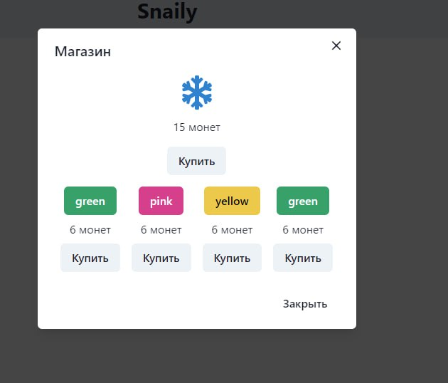

# Snaily

## Описание

Веб-приложение task manager использующее систему мотивации и поощрений для ежедневного выполнения задач

## Установка

1. Клонируйте репозиторий:

```sh
git clone https://github.com/snaily418/front/
cd front
```

2. Установите все зависимости:

```sh
npm i
```

### Используемые библиотеки

1. React
2. chakra-ui
3. axios
4. redux
5. react-redux

## Запуск приложения

Перед запуском приложение нужно собрать

```sh
npm run build
```

После можно локально запустить предпросмотр приложения

```sh
serve -s build
```

Если `serve` не установлен, его следует установить

```sh
npm install -g serve
```

## Поехали!

Приложение запущено по адресу

http://localhost:3000

# Команда проекта

Миша - Front Engineer \
Родион - Front Engineer \
Коля - Team Lead \
Даня - Backend Engineer \
Гоша - Project Manager

# Несвязанный с беком магазин

